# Architecture

## Overview

`zen-gc` is a Kubernetes controller that implements generic garbage collection policies for any Kubernetes resource. It follows the standard Kubernetes controller pattern with informers, work queues, and reconciliation loops.

## System Architecture

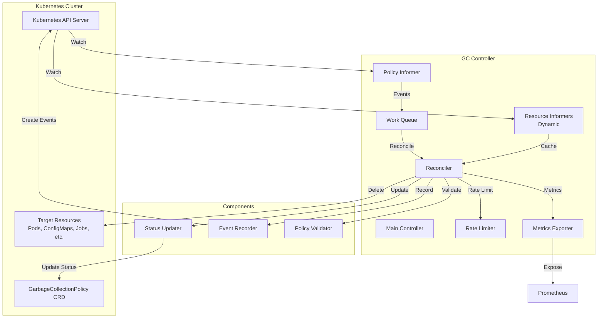

## Component Details

### 1. Main Controller (`cmd/gc-controller/main.go`)

The entry point that:
- Initializes Kubernetes clients (dynamic, core)
- Sets up leader election for HA
- Creates and starts the GC controller
- Configures metrics server
- Handles graceful shutdown

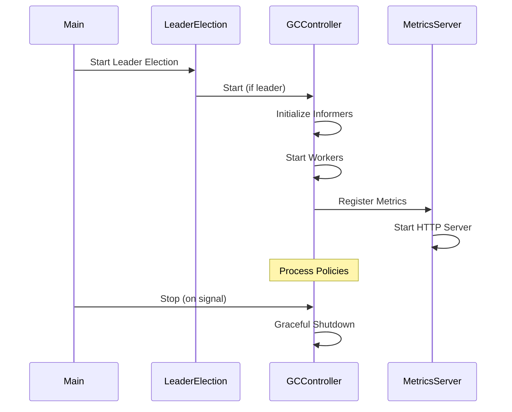

### 2. GC Controller (`pkg/controller/gc_controller.go`)

Core controller logic:

**Responsibilities:**
- Watch `GarbageCollectionPolicy` CRDs
- Create dynamic informers for target resources
- Evaluate policies against resources
- Delete resources that match TTL/conditions
- Update policy status
- Emit metrics and events

**Key Methods:**
- `NewGCController()`: Initialize controller with clients
- `Start()`: Start informers and workers
- `evaluatePolicies()`: Main reconciliation loop
- `evaluatePolicy()`: Evaluate single policy
- `deleteResource()`: Delete resource with rate limiting

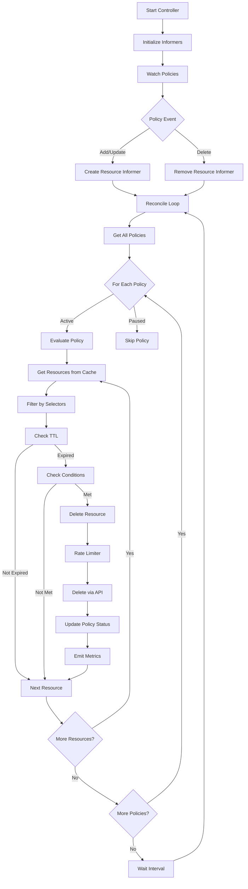

### 3. Policy Evaluation Flow

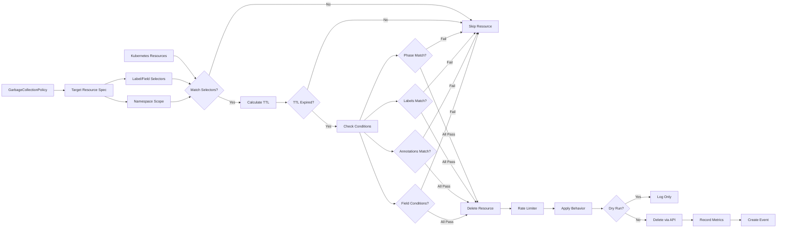

### 4. Informer Architecture

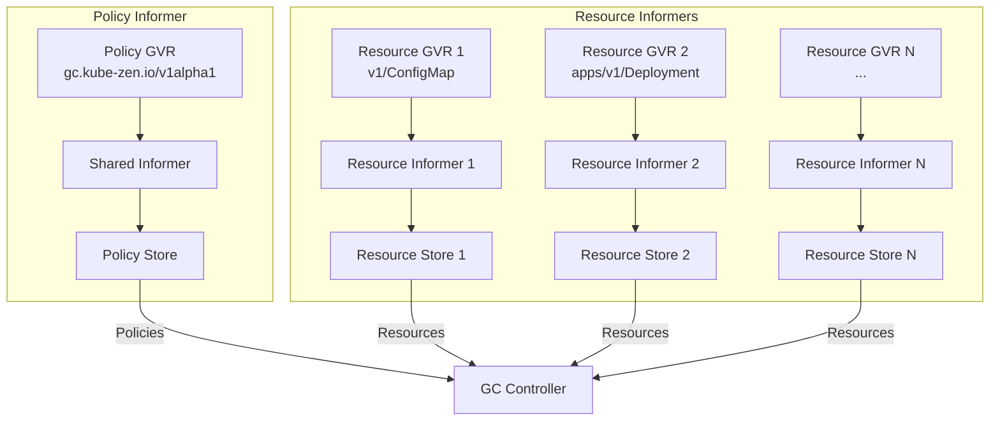

### 5. Rate Limiting

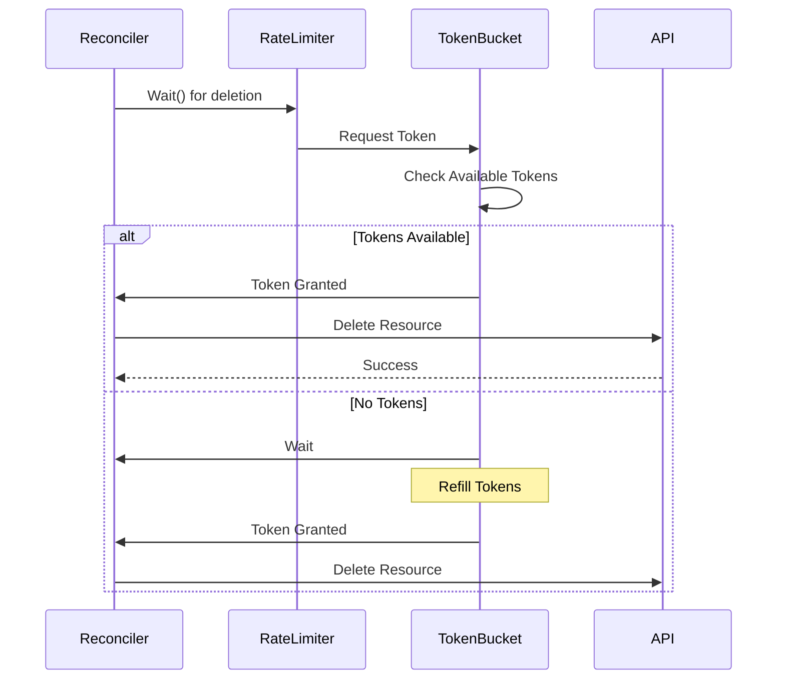

### 6. Metrics Flow

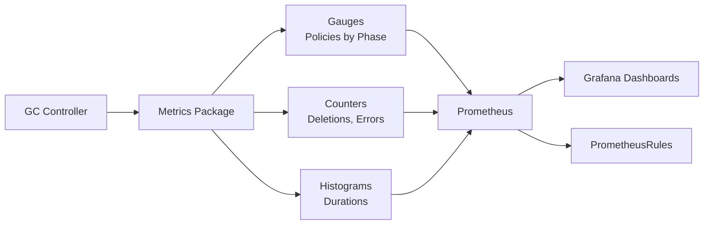

## Data Flow

### Policy Creation Flow

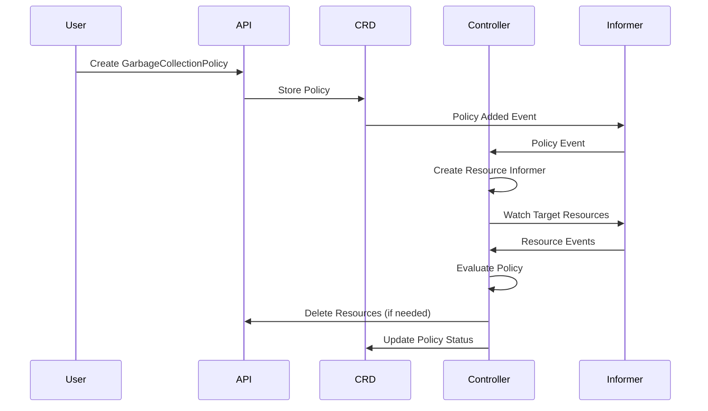

### Resource Deletion Flow

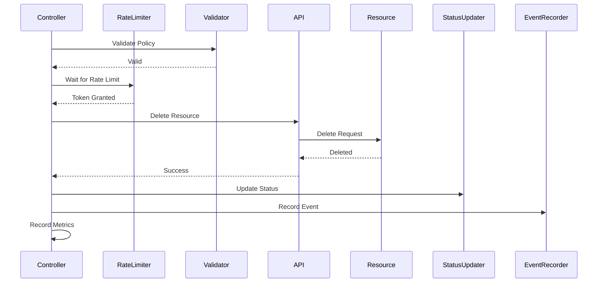

## High Availability

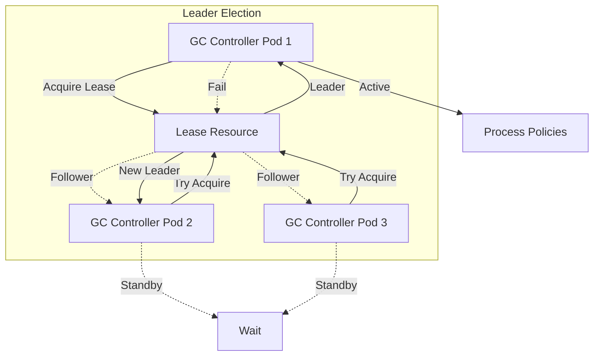

## Security Model

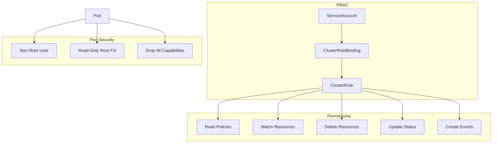

## Deployment Architecture

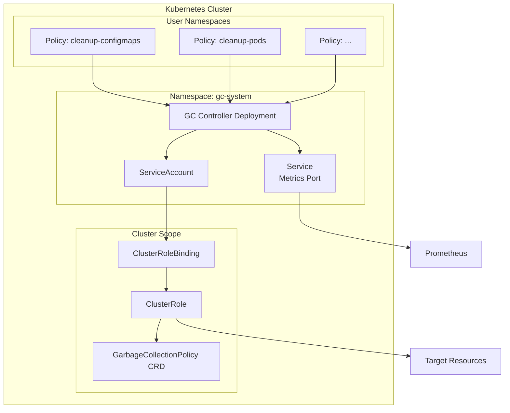

## Performance Considerations

### Informer Caching

- **Policy Informer**: Single informer for all policies (cluster-wide or namespace-scoped)
- **Resource Informers**: One informer per unique GVR (GroupVersionResource)
- **Cache Efficiency**: Resources cached in memory, reducing API server load
- **Resync Period**: Configurable resync interval (default: 1 minute)

### Rate Limiting

- **Token Bucket Algorithm**: Smooth rate limiting with burst support
- **Per-Policy Rate**: Each policy can specify `maxDeletionsPerSecond`
- **Default Rate**: 10 deletions/second (configurable)
- **Batching**: Optional batch size for efficient deletions

### Scalability

- **Horizontal Scaling**: Multiple controller replicas with leader election
- **Resource Limits**: Configurable CPU/memory limits
- **Worker Threads**: Configurable number of worker goroutines
- **Queue Depth**: Work queue prevents memory bloat

## Error Handling

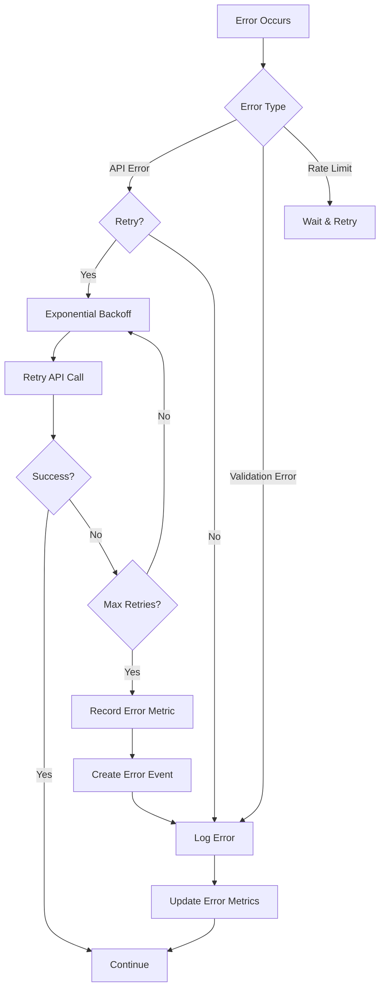

## Monitoring & Observability

### Metrics

- **Policy Metrics**: Number of policies by phase
- **Resource Metrics**: Matched, deleted, pending resources
- **Performance Metrics**: Evaluation duration, deletion duration
- **Error Metrics**: Error counts by type

### Events

- **Policy Events**: Policy evaluation started/completed/failed
- **Resource Events**: Resource deleted with reason
- **Error Events**: Deletion failures, status update failures

### Logging

- **Structured Logging**: Using klog with structured fields
- **Log Levels**: Configurable verbosity (V levels)
- **Context**: Policy name, resource name, namespace in logs

## Extension Points

### Custom TTL Calculations

The controller supports multiple TTL calculation methods:
- Fixed TTL (`secondsAfterCreation`)
- Field-based TTL (`fieldPath`)
- Relative TTL (`relativeTo`)
- Mapped TTL (`mappings`)

### Custom Conditions

Policies can specify complex conditions:
- Phase matching
- Label matching
- Annotation matching
- Field conditions (equals, not equals, in, not in, etc.)

### Behavior Customization

Each policy can customize deletion behavior:
- Rate limiting (`maxDeletionsPerSecond`)
- Batch size (`batchSize`)
- Dry run mode (`dryRun`)
- Grace period (`gracePeriodSeconds`)
- Propagation policy (`propagationPolicy`)

